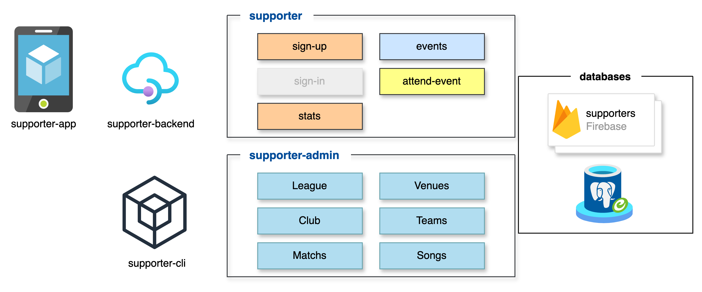

# Project

**champion-league**

This project uses Quarkus, the Supersonic Subatomic Java Framework, to manage sports venues and their locations.

## Project Structure

The project follows a clean architecture pattern with the following structure:

```plaintext
src/main/kotlin/com/supplier/championleague/
├── controller/
│   └── {{RESOURCE}}Controller.kt       # REST endpoints for venue operations
├── service/
│   └── {{RESOURCE}}Service.kt          # Business logic layer
├── repositories/
│   ├── {{RESOURCE}}Repository.kt       # Data access for venue information
└── model/
    ├── {{RESOURCE}}.kt                 # Core venue data model
```

## Key Components

- Quarkus application is the main entry point for the application. It contains the main method that starts the application and routes requests to the appropriate controller methods.

- Dockerfile is used to build a Docker image for the application.

- Databases:  
  - PostgreSQL database for storing venue information.
  - PostGIS database for storing spatial data.
  - Firebase for all documents.

- Deployment script is used to deploy the application to a Kubernetes cluster. The cluster is configured at Civo account.

### Architecture:


### Technologies Used

- **Quarkus**: Main framework
- **Kotlin**: Programming language
- **Firebase/Firestore**: Document database for venue data
- **PostGIS**: Spatial database extension for geographical queries
- **Hibernate Spatial**: JPA implementation for spatial data

#### About postgis

PostGIS is an open source spatial database that extends the PostgreSQL database to support spatial data types and operations. It provides a set of functions and operators for working with spatial data, such as points, lines, and polygons. PostGIS is used in this project to store and query the locations of venues.

The PostGIS database is hosted on a public cluster to be accessed directly by the services. The approach that we are using to deploy the database is to use a Percona Cluster. For more information in how to setup a Percona Cluster, please refer to the [our percona cluster documentation](./spatialDatabase.md).

#### About hibernate spatial

Hibernate Spatial is a JPA implementation for spatial data. It provides a set of annotations and interfaces for working with spatial data, such as points, lines, and polygons. Hibernate Spatial is used in this project to store and query the locations of venues.

## API Documentation

Refer to the [Champion League API documentation](./api/README.md) for information about the available endpoints and their usage.

### Authentication

- `POST /auth/verify`
  - Verify JWT token
  - Request body: `{ "token": "your-jwt-token" }`
  - Response: `{ "uid": "user-id" }` or error message

### Users

- `POST /v1/users`
  - Create a new user
  - Request body: `{ "id": "uid", "name": "username", "email": "user@example.com" }`
  - Response: `{ "message": "User added successfully" }`

- `GET /v1/users`
  - Get all users
  - Response: Array of user objects

- `GET /v1/users/{uid}`
  - Get user by ID
  - Response: User object or 404 if not found

### Teams

- `GET /v1/teams`
  - Get all teams
  - Response: Array of team objects

- `GET /v1/teams/{id}`
  - Get team by ID
  - Response: Team object or 404 if not found

### Leagues

- `GET /v1/leagues`
  - Get all leagues
  - Response: Array of league objects

### Matches

- `GET /v1/matches`
  - Get all matches
  - Response: Array of match objects

- `GET /v1/matches/{uid}`
  - Get match by ID
  - Response: Match object or 404 if not found

- `GET /v1/matches/{uid}/details`
  - Get detailed match information (including venue, teams, and league)
  - Response: Detailed match information or 404 if not found

### Events

- `GET /v1/events`
  - Get all events
  - Response: Array of event objects

- `GET /v1/events/inqueries`
  - Search events by location and date
  - Query parameters:
    - `lat`: Latitude (optional)
    - `long`: Longitude (optional)
    - `date`: Date (optional)
    - `limit`: Maximum results (optional)
    - `offset`: Result offset (optional)
  - Response: Array of event objects or 404 if not found

### Venues

- `GET /v1/venues`
  - Get all venues
  - Response: Array of venue objects

- `GET /v1/venues/positions`
  - Search venues by geographical coordinates
  - Query parameters:
    - `lat`: Latitude
    - `long`: Longitude
  - Response: Array of venue objects or 404 if not found

### Response Format

All endpoints return JSON responses with the following status codes:
- 200: Success
- 400: Bad Request (invalid input)
- 401: Unauthorized (invalid token)
- 404: Not Found
- 500: Internal Server Error

## Running the application in dev mode

You can run your application in dev mode that enables live coding using:

```shell script
./mvnw quarkus:dev
```

> **_NOTE:_**  Quarkus now ships with a Dev UI, which is available in dev mode only at <http://localhost:8080/q/dev/>.

## Packaging and running the application

The application can be packaged using:

```shell script
./mvnw package
```

It produces the `quarkus-run.jar` file in the `target/quarkus-app/` directory.
Be aware that it’s not an _über-jar_ as the dependencies are copied into the `target/quarkus-app/lib/` directory.

The application is now runnable using `java -jar target/quarkus-app/quarkus-run.jar`.

If you want to build an _über-jar_, execute the following command:

```shell script
./mvnw package -Dquarkus.package.jar.type=uber-jar
```

The application, packaged as an _über-jar_, is now runnable using `java -jar target/*-runner.jar`.

## Creating a native executable

You can create a native executable using:

```shell script
./mvnw package -Dnative
```

Or, if you don't have GraalVM installed, you can run the native executable build in a container using:

```shell script
./mvnw package -Dnative -Dquarkus.native.container-build=true
```

You can then execute your native executable with: `./target/champion-league-1.0.0-SNAPSHOT-runner`

If you want to learn more about building native executables, please consult <https://quarkus.io/guides/maven-tooling>.

### Build and push to docker hub

`docker build -f src/main/docker/Dockerfile.jvm --platform=linux/amd64 -t {{hub_account}}/champions-league:${version} .`


## Code Example

### REST invokation using `curl`

```shell script
export BASE_URL=http://localhost:8080
export BASE_URL_REMOTE=http://champion-league.e9bb0838-6437-45ef-847c-e04a5df6f617.k8s.civo.com
# camp nou venue:
curl -iv "${BASE_URL}/events/inqueries?lat=2.1202449&long=41.3809&date=2025-04-30"
```

```shell script
# no camp venue:
curl -iv 'http://localhost:8080/events/inqueries?lat=2.1078&long=41.5469&date=2025-04-30'
```

### Test data

Camp Nou: long=2.1202395&lat=41.3809&maxDistance=1000


